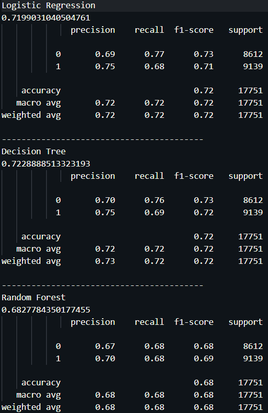
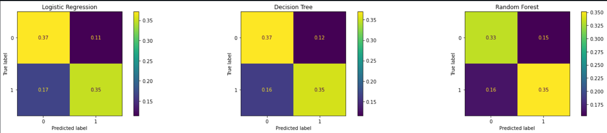
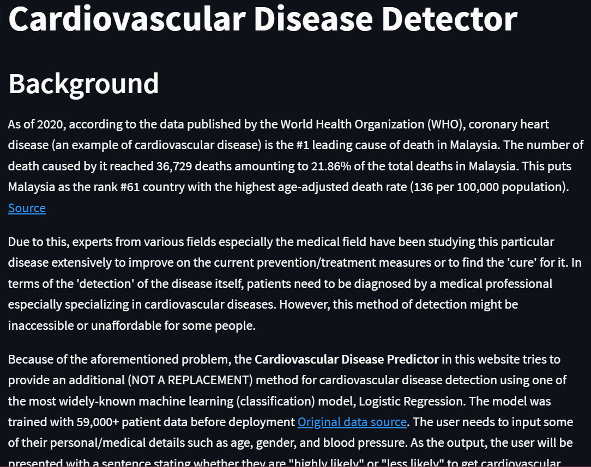
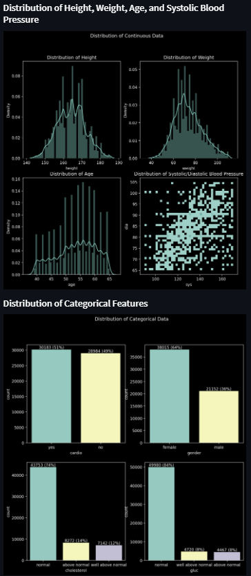
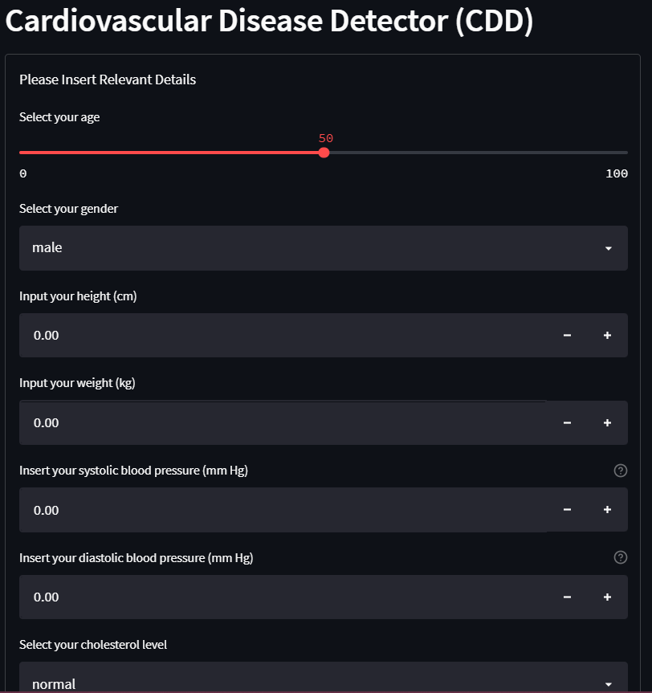

# Project: Cardiovascular Disease Detector

# Description
The project is about developing a web app for predicting whether an individual is less or more susceptible to get cardiovascular disease. The web app are developed using Python's Streamlit library. For the predictive model, it is obtained by training and comparing the performance of 3 machine learning classification algortihms i.e. Logistic Regression, Decision Tree, and Random Forest. All 3 classification algorithm was trained and tested on the [Cardiovascular Disease Dataset](https://www.kaggle.com/datasets/sulianova/cardiovascular-disease-dataset) consisting of 70,000+ records of patients data. 

# How to Install and Run the Project
## Running the model training & testing
Clone the whole repository and then, proceed to the directory containing the cloned repository. Locate the `cardio_predictions.py` file and run it in the terminal or in any of your preferred IDEs. In a few seconds, all the relevant process e.g. data loading, EDA, model training, and results will be generated.

## Running the web app
To run the web app on a localhost web browser, download/clone the whole repository first. Then, proceed to the directory containing the cloned repository. In the terminal while also in this particular directory, execute `streamlit run app.py`. In a few seconds, the web app will automatically launch as a tab in your default browser.

# How to Use the Web App Predictor
The usage is quite simple. Just input your relevant details as prompted in the form in the web app. Then, submit the filled details and the app will display the generated predictions from the trained model.

# Results
## Algorithm performances
### Classification report

### Confusion matrix

## Web app screenshots

# Credits
- [Cardiovascular Disease Dataset](https://www.kaggle.com/datasets/sulianova/cardiovascular-disease-dataset)
- [Markdown badges source 1](https://github.com/Ileriayo/markdown-badges)
- [Markdown badges source 2](https://github.com/alexandresanlim/Badges4-README.md-Profile)